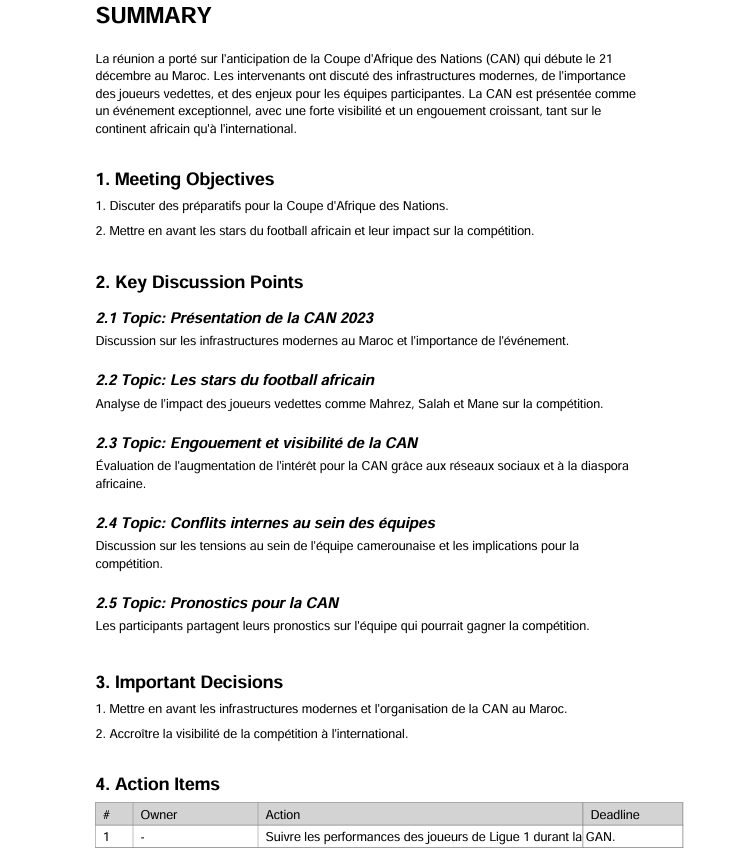
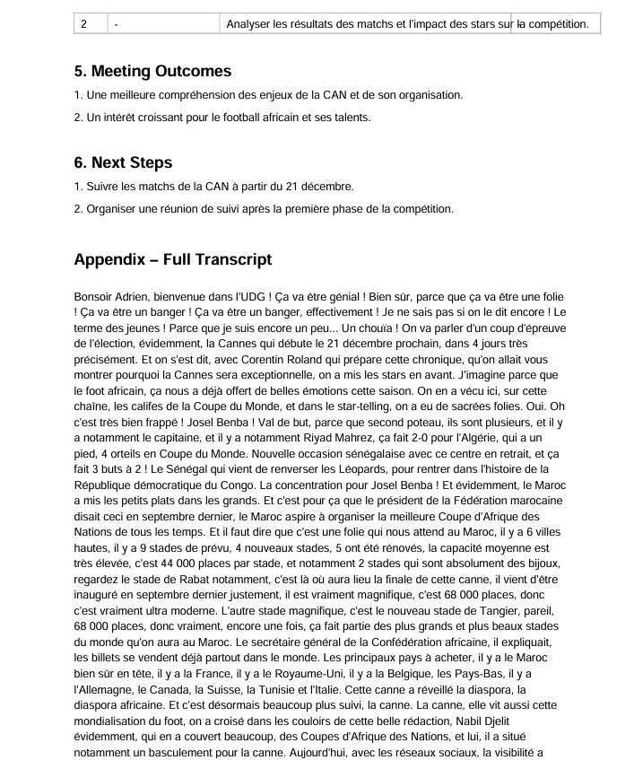

# Meeting AI Assistant – Report Generator

Ce projet permet de générer des **rapports de réunion** à partir de fichiers audio.

L’application permet :

- 📝 **Transcription automatique** de réunions (via OpenAI, modèle ASR)
- 🧑‍🤝‍🧑 **Segmentation par locuteurs (diarisation simple)** par alternance en fonction des pauses
- 📊 **Génération de notes structurées** : sujets, décisions, actions
- 📄 **Export des rapports** au format **Markdown** et **PDF**
- 💻 **Interface Streamlit** pour tester le flux de bout en bout

---

## 1. Stack technique

- **Backend** : FastAPI (Python 3.11)
- **Frontend** : Streamlit
- **Transcription audio** : OpenAI Audio API (modèle `gpt-4o-mini-transcribe` ou Whisper compatible)
- **Traitement audio** : `pydub` + `ffmpeg`
- **Génération de résumé** : OpenAI Chat Completions (`gpt-4o-mini`)
- **Exports** :
  - Markdown : rendu manuel
  - PDF : `reportlab` avec un template structuré

---

## 2. Architecture générale

### 2.1. Vue d’ensemble

- `main.py`  
  Point d’entrée FastAPI (inclusion des routers, CORS, config).

- `app/api/reports.py`  
  Endpoints pour :
  - `/reports/transcribe` : transcription pure
  - `/reports/notes` : génération des notes + fichiers d’export
  - `/reports/files/{report_id}/{filename}` : téléchargement des fichiers générés

- `app/services/transcription.py`  
  Logique de transcription audio :
  - chargement + resampling audio (`pydub`)
  - découpage en chunks
  - appel à l’API OpenAI
  - reconstruction du texte + segments (timestamps)

- `app/services/notes.py`  
  Génération et export des notes :
  - `generate_structured_notes()` : prompt + appel OpenAI pour structurer le compte-rendu
  - `render_markdown()` : construction du Markdown
  - `generate_pdf_report()` : création d’un PDF “propre” (résumé, sujets, décisions, actions, transcription)

- `app/models/notes.py`  
  Schemas Pydantic pour :
  - `MeetingSummary` (executive summary, topics, decisions, actions)
  - `NotesResponse`

- `app/schemas/reports.py`  
  Schemas de réponse pour `/reports/transcribe`.

- `streamlit_app.py`  
 Interface utilisateur :
  - upload d’un fichier audio
  - bouton “Transcription”
  - bouton “Générer les notes”
  - boutons de téléchargement Markdown / PDF

---

## 3. Installation & configuration

### 3.1. Prérequis

- Python 3.11+
- Docker & Docker Compose 

### 3.2. Variables d’environnement

Créer un fichier `.env` à la racine :
```env
DEBUG=true
SECRET_KEY=secret
DB_ENGINE=sqlite  # or postgresql
# For PostgreSQL, add these:
# DB_USER=postgres
# DB_PASSWORD=password
# DB_HOST=localhost
# DB_PORT=5432
# DB_NAME=app
#HUGGINGFACE_TOKEN=XXXXXXXXXXXX
#BACKEND=hf
OPENAI_API_KEY=sk-XXXXXXXXXXXXXXXX
BACKEND=openai
#ASR_MODEL_ID=gpt-4o-mini-transcribe 
ASR_MODEL_ID=whisper-1
```

## Docker

The project includes Docker configurations for both development and production:

- `docker-compose.yml`: Production setup
- `docker-compose.dev.yml`: Development setup with hot-reload
## 4️. Utilisation

### Lancer le backend FastAPI avec Docker

```bash
docker compose -f docker-compose.dev.yml up --build
```
### Lancer l’interface Streamlit
```
streamlit run streamlit_app.py
```

## Contributing

1. Fork the repository
2. Create a feature branch: `git checkout -b ft/my-feature`
3. Commit your changes: `git commit -m 'Add my feature'`
4. Push to the branch: `git push origin ft/my-feature`

## Aperçu du projet

Voici quelques captures d’écran illustrant le fonctionnement de l’application :

### 🔹 Interface Streamlit – Transcription Audio


### 🔹 Résumé Structuré du Rapport (PDF)


### 🔹 Détails du Rapport (Décisions, Actions, Transcript)


### 🔹 Détails du Markdown (Décisions, Actions, Transcript)

